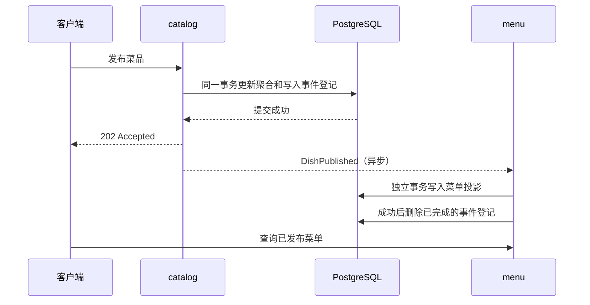

# Han Menu

基于 Java 25、Spring Boot 4.1.1、Spring Modulith 2.1.1 的 DDD 模块化单体学习项目。
单个 Maven 工程、单个可执行 JAR，按限界上下文划分模块，模块内部采用端口与适配器结构。

## 快速开始

环境要求：JDK 25、Podman、已有 PostgreSQL 容器 `pg18`。Maven Wrapper 固定为 3.9.16。

```bash
# 首次配置：启动已有容器，创建项目账号、开发库和测试库，生成权限为 600 的 .env。
./scripts/setup-local-db.py
./scripts/install-hooks.sh

# 完整质量门禁：Google 格式、Checkstyle、单元/架构/真实数据库集成测试。
./scripts/verify.sh

# 启动开发服务，默认仅监听 127.0.0.1:8080。
./scripts/with-env.sh ./mvnw spring-boot:run
```

脚本复用 `pg18`（本机 PostgreSQL 18.6），不重建容器，不升级镜像，不修改已有业务库。
开发库 `han_menu`、测试库 `han_menu_test`，连接账号 `han_menu`。密码只在忽略提交的 `.env` 中。
容器名称不同时使用 `PG_CONTAINER=你的容器名 ./scripts/setup-local-db.py`；其他环境可参考
`.env.example` 配置环境变量。Spring Boot 不会自行读取 `.env`，请使用 `with-env.sh` 或在 IDE 中配置环境变量。

## 可运行的业务闭环

```bash
# 创建草稿，响应包含 id。
curl -sS http://localhost:8080/api/catalog/dishes \
  -H 'Content-Type: application/json' \
  -d '{"name":"番茄鸡蛋面","price":18.50}'

# 将下面的 UUID 替换为上一步返回的 id；成功为 202。
curl -i -X POST http://localhost:8080/api/catalog/dishes/你的UUID/publication

# 异步投影，发布后稍候即可在菜单中看到菜品。
curl -sS http://localhost:8080/api/menu
curl -sS http://localhost:8080/actuator/health
```

价格单位固定为人民币元，最多两位小数且必须为正数；重复发布返回 409，菜品不存在返回 404，
非法请求返回 400，错误使用 Problem Details。该示例只演示草稿创建与一次发布，尚未定义价格变更、
下架和订单业务。菜单列表目前面向小规模学习数据，后续业务扩展时再引入分页。

## 架构与学习路径

```text
com.hanserwei.hanmenu
├── HanMenuApplication
├── catalog                         菜品目录上下文
│   ├── events                      唯一对外开放的 named interface
│   │   └── DishPublished           不可变集成事件
│   ├── domain                      Dish 聚合、DishId/Price 值对象、仓储端口
│   ├── application                 用例编排、事务、发布集成事件
│   ├── infrastructure              JdbcClient 仓储适配器、乐观锁
│   └── web                         HTTP DTO、校验、异常映射
└── menu                            已发布菜单上下文
    ├── domain                      自有读模型和仓储端口
    ├── application                 模块事件监听、菜单查询
    ├── infrastructure              独立投影表、幂等写入
    └── web                         菜单查询 API
```



建议按以下顺序阅读：

1. `catalog/domain/Dish`、`Price`：不依赖 Spring 的业务规则和状态转换。
2. `catalog/application/CatalogService`：事务边界、仓储端口和集成事件。
3. 两个 `package-info.java` 与 `catalog/events/package-info.java`：模块依赖与导出契约。
4. `menu/application/MenuService`：`@ApplicationModuleListener` 带来的异步、提交后、独立事务语义。
5. `MenuFlowIt`：真实 PostgreSQL 上的事务回滚、乐观锁、重复投递与故障恢复。
6. `CatalogModuleIt`：`@ApplicationModuleTest` 和 `Scenario` 隔离测试单一模块。
7. `ArchitectureTest`：Modulith 验证模块依赖/循环引用，ArchUnit 验证分层和纯领域模型。

DDD 的边界需要随业务认识演化；这里提供可执行、可验证的起点。目录模块包含行为丰富的聚合，
菜单模块是简单的事件驱动读模型，不为了形式引入不必要的聚合、通用 BaseRepository 或共享实体。
领域模型不带 ORM 注解，使用显式 JDBC 映射，方便观察每条 SQL 与事务行为。

## 模块边界与事件可靠性

- `catalog` 不允许依赖其他业务模块；`menu` 只允许依赖 `catalog :: events`。
- 模块内部类型即使因为 Java 子包访问需要声明为 public，也不等于 Modulith 的公开 API。
- 运行时与测试都会验证模块结构；禁止跨模块访问内部类型、跨模块 SQL 和共享数据库实体。
- `catalog_dish`、`menu_entry` 各自归属模块，不建立跨上下文外键或查询关联。
- JDBC 事件登记与菜品更新共享数据库事务。发布事务回滚时，事件登记一起回滚。
- 消费失败时登记保留；单实例应用重启会重投未完成事件，也可通过
  `IncompleteEventPublications` 显式重投。当前未配置周期性自动重试或公开重试管理接口。
- 这是至少一次投递：监听器使用 `ON CONFLICT (dish_id) DO NOTHING` 保证一次发布场景的幂等。
  如果增加改价/下架事件，需要加入版本与事件顺序规则，不能直接复用当前插入逻辑。
- 成功消费后删除登记，避免无限累积；事件登记不是审计日志或 Event Sourcing 事件库。
- Flyway 管理业务表和 Modulith v2 事件表。升级 Modulith 时需核对官方 schema，并新增迁移。
- 多实例部署前需要重新评估重投竞争、重试和运维策略；当前配置针对本地单实例学习。

## Google Java 规范与提交门禁

```bash
./mvnw spotless:apply       # Google Java Format 自动修正
./mvnw validate             # 格式 + Google Checkstyle，包含测试源码
./scripts/verify.sh         # 每次编码完成后、提交前必须执行
```

Spotless 3.10.2 使用 Google Java Format 1.36.1；Maven Checkstyle Plugin 3.6.0 使用
Checkstyle 14.1.0 自带的 `google_checks.xml`。`violationSeverity=warning` 使 Google 规则警告也会失败，
不通过抑制规则掩盖问题。自动工具覆盖可检查的规则；命名含义和注释质量仍需代码审查。

`.githooks/pre-commit` 执行 `clean verify`。为确保扫描内容和暂存内容一致，提交前需要完整暂存
代码并处理未跟踪文件。全新克隆后执行 `./scripts/install-hooks.sh`，Git 不会自动启用仓库里的钩子。
本地钩子可被用户绕过，不能代替服务端保障；配置 GitHub 远程后，将 `Verify / verify` 设置为分支保护
的必需检查。仓库内的 GitHub Actions 已配置 PostgreSQL 18.6 和完整验证，当前尚未连接远程仓库。

测试不使用 H2、不依赖 Docker socket、不静默跳过数据库测试。每个集成测试上下文在测试库中创建
随机 schema，完成后删除；测试数据库名称必须以 `_test` 结尾。进程被强制结束时可能留下 `test_*`
schema，可确认没有测试运行后手动清理。
故障恢复测试会故意触发一次 `simulated_outage` 数据库约束异常，随后验证重投成功；该测试中的
预期 ERROR 日志不代表构建失败，以测试报告和 Maven 退出码为准。

检查结果和自动生成的模块文档位于：

- `target/checkstyle-result.xml`
- `target/surefire-reports/`、`target/failsafe-reports/`
- `target/spring-modulith-docs/`：Asciidoc 模块文档和 PlantUML 图

打包结果为 `target/han-menu-0.0.1-SNAPSHOT.jar`，可使用
`./scripts/with-env.sh java -jar target/han-menu-0.0.1-SNAPSHOT.jar` 运行。

## 版本与新特性

稳定版本于 2026-09-17 通过 Maven Central 元数据及官方文档核对。Spring Boot / Modulith BOM
统一管理 Spring Framework、Jackson、PostgreSQL JDBC、Flyway 和测试依赖，优先保持已验证的兼容组合，
不逐项覆盖为未经组合验证的最新版。未使用 milestone、RC 或 snapshot 第三方依赖。

已经使用 records、switch 表达形式、文本块、Stream API、Java 25 虚拟线程运行时与 Jackson 3。
不启用 preview。Google Java Style 明确不使用 Java 25 的 compact source files 与 module imports，
因此保留标准 package、class 和显式 imports。

参考：[Spring Boot](https://spring.io/projects/spring-boot)、
[Spring Modulith](https://docs.spring.io/spring-modulith/reference/)、
[模块事件](https://docs.spring.io/spring-modulith/reference/events.html)、
[Google Java Style](https://google.github.io/styleguide/javaguide.html)。
