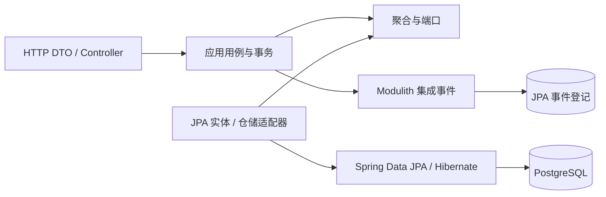

# Han Menu 架构决策

## 产品定位

这是以苍穹外卖业务能力为参考的全新外卖系统。没有旧用户、旧业务数据或旧客户端契约需要承接。
管理端、Flutter 移动端 App、领域模型、API 和表结构都按新版本设计。当前实现员工身份、顾客、购物车、目录、门店、订单、支付、通知和统计模块，客户端交付按 P7 推进。

本项目为个人学习项目，支付测试采用支付宝沙箱，不要求正式商户资质或生产资金交易。
移动端与支付接口的规划边界见 [决策记录](MOBILE_PAYMENT_DECISION.md)；P5 已实现沙箱支付与退款；Flutter 工程留待 P7。

## 模块化单体与 DDD

一个 Maven 工程构建一个 Spring Boot 应用，使用 Spring Modulith 定义限界上下文，自动校验
公开契约、循环依赖和内部类型访问。业务组织为 identity、customer、shop、catalog、cart、
ordering、payment、notification、reporting 九个模块。

| 分层 | 负责内容 | 实现边界 |
| --- | --- | --- |
| domain | 聚合、值对象、不变量、领域策略、仓储端口 | 纯 Java，聚合通过业务方法改变状态 |
| application | 用例、权限检查、事务与跨模块协作 | 依赖端口，负责加载、调用、保存聚合 |
| infrastructure | 数据存取、缓存、外部服务适配 | Spring Data JPA/Hibernate、Redis 等具体技术 |
| web | 请求校验、身份提取、DTO 映射、HTTP 协议 | Spring MVC，禁止返回 ORM 实体 |
| api / events | 明确发布的同步契约与集成事件 | Spring Modulith NamedInterface |

权限、价格、订单状态迁移等规则由具备行为的领域对象保护。组合和构造器注入是默认方式，接口
设置在真实变化点，避免机械创建 Service/ServiceImpl、BaseEntity、BaseService 继承体系。

## ORM 与持久化

业务持久化统一使用 **Spring Data JPA 4.1.1 + Hibernate 7.4.5.Final**，版本由 Boot BOM 管理。
Spring Modulith 的事件登记也使用 JPA 实现，与业务更新共享 JpaTransactionManager。

- 常规 CRUD 和查询条件使用 Spring Data 派生方法，不在业务代码中拼装 SQL。
- 批量条件使用 JPA Criteria / Spring Data 4.1 PredicateSpecification，批量删除不加载全部实体。
- 动态组合条件和复杂读取在出现具体需求时使用 Specification、投影和专用查询端口。
- `@Version` 检测并发写入；更新 API 必须提供资源版本，陈旧编辑返回 409。
- Session 使用实体图一次获取员工状态，避免认证时额外懒加载查询。
- `spring.jpa.open-in-view=false`，事务在应用用例中完成，Controller 序列化期间不查询数据库。
- `ddl-auto=validate`，Hibernate 校验映射；Flyway 维护建表、约束和索引的版本化 DDL。
- UUID 由领域用例分配，新增员工实体保持包装类型 version 为 null，由 Spring Data 正确识别为新实体。

### 为什么领域模型与 JPA 实体分开

领域对象需要封装行为，JPA 实体需要配合代理、关联抓取及持久化上下文。两者通过每个持久化模型
的集中映射连接，防止数据库关系、框架注解或懒加载进入领域行为和 HTTP 响应。

这会多一个映射位置，换来清晰的依赖方向；映射集中在实体与仓储适配器，不再分散于每条 SQL 的
参数绑定和 ResultSet 处理中。简单适配器不再额外套通用 RepositoryImpl 或反射 BeanUtils 拷贝。

JPA 关系限于模块内部。不同限界上下文之间只保存稳定业务标识，通过公开 API 或事件协作，不建立
跨模块实体关联、跨模块外键或查询其他模块业务表。

## API 约定

- `/api/v1` 版本化资源路径，HTTP 方法表达操作语义。
- 创建返回 201 和 Location；读取返回 200；成功更新或撤销返回 204。
- 成功直接返回资源 DTO；失败统一为 RFC 9457 Problem Details，扩展 code、traceId。
- 身份认证只支持 `Authorization: Bearer ...`，服务端不从 Cookie 提取认证信息。
- UUID 以 JSON 字符串返回；所有业务时刻使用 Instant 和 ISO-8601 UTC 表达。
- 分页 page 从 0 开始，默认 size=20，上限 100；分页响应不泄露 PageImpl 的框架结构。
- 严格拒绝未知 JSON 字段；资料更新和状态修改的 version 必填。
- 模块异常处理优先于通用兜底，RFC 9457 的扩展字段由工程统一输出。
- 状态使用 ACTIVE、DISABLED 等具名值，不使用业务魔法数字。

具体身份接口见 [P1 契约](P1_CONTRACT.md)。业务参考只用于识别用例，不决定本系统 URI、字段或响应。

## 事务与模块事件

一个应用用例对应明确的事务边界。跨模块强一致操作通过公开契约参与短本地事务；通知、报表等
异步协作用持久化事件表达已提交的业务事实。外部支付网络调用不放入长数据库事务。

JPA 聚合更新和 Modulith 事件登记同事务提交或回滚；消费者必须通过业务键/事件标识实现幂等。
当前单实例配置允许重启重投，后续业务监听器落地时补充有界重试、失败记录及可观测性。
事件登记用于可靠投递，不替代审计日志或事件溯源模型。

订单调用支付公开 API，并监听支付结果事件；支付使用不透明业务引用，不反向引用订单模块，
防止形成编译依赖环。通知和报表消费公开事件；报表按需求建设自己的读模型。

## 当前身份边界

identity 只保存账号、显示名称、可选联系电话及认证状态。身份证、性别等不属于当前账号管理的
必需资料，未来真实的人事需求应单独建模，不因参考项目存在字段而自动收集。

P1 的管理员通过初始化创建，普通员工由管理员创建，角色固定为 ADMIN/STAFF；动态角色授权在
出现明确业务需求后扩展。密码使用 BCrypt，随机会话令牌只保存摘要，停用/改密即时撤销旧会话。
Redis 独立限制账号和直连地址请求量；缓存故障不能绕过登录控制。

P3 顾客认证使用手机号标识和密码，独立会话表及优先匹配的顾客安全链，不要求微信或短信服务。
号码未核验归属，不作为找回密码凭证；顾客令牌不能用于员工路径。cart 仅使用 customer/catalog
的公开 API，地址默认切换按顾客行加锁，购物车依赖独立聚合版本。详细协议见 [P3 契约](P3_CONTRACT.md)。

## 数据库基线与演进

当前基线为 V1 身份模块、V2 JPA 事件登记，P2 新增 V3 目录与门店，P3 新增 V4 顾客与购物车，P4 新增 V5 未支付订单，P5 新增 V6 支付与履约，P6 新增 V7 通知与统计投影。没有旧账号导入、
演示业务表、兼容表或历史数据转换流程。后续迭代通过新增 Flyway 迁移演进，不依赖 Hibernate 自动改表。

开发初期的架构试验快照保存在被 Git 忽略的本地备份目录，仅用于误操作恢复，不参与应用启动或设计。
项目开发库、测试库与 `pg18_lab` 等其他数据库相互独立。

## 可执行的架构约束

- Modulith 校验模块导出与无环依赖。
- ArchUnit 约束向内依赖、纯领域模型，并禁止生产代码依赖 JdbcClient/JDBC API。
- 真实 PostgreSQL 测试验证 ORM 映射、Hibernate 版本锁和持久化事件的事务回滚。
- 认证实体图的查询数量有验证，关闭 Open-in-View 后接口仍能完整序列化。
- Google Java Format、Checkstyle、中文注释与完整测试作为提交门禁。

参考：[Spring Data 实体持久化](https://docs.spring.io/spring-data/jpa/reference/jpa/entity-persistence.html)、
[派生查询](https://docs.spring.io/spring-data/jpa/reference/jpa/query-methods.html)、
[Modulith 事件机制](https://docs.spring.io/spring-modulith/reference/events.html)。

## P2 目录实现决策

菜单商品共用 MenuProduct 聚合，通过不可变的 DISH/SET_MEAL 种类维护口味及组成差异，避免
重复两套 CRUD。分类、商品和图片在 catalog 内拥有独立资源。后台低频写入通过目录修订行串行
检查跨聚合引用，同时用版本号防止陈旧编辑。缓存使用同事务修订号隔离代际，详情和未来下单校验
读取数据库。shop 独立维护当前营业状态，两者仅依赖 identity 的公开授权契约。

具体限制、图片上传补偿边界和查询策略见 [P2 契约](P2_CONTRACT.md)。

## P4 订单结算决策

ordering 通过 customer/shop/catalog/cart 的公开契约参与同一本地事务：顾客行锁保护地址和
幂等查重，门店行锁保护营业检查，目录修订锁固定当前价格与套餐组成，购物车版本保护结算隔离。
订单保存独立的地址、商品及套餐快照，详情不再依赖当前地址簿或目录。取消仅改变状态；再来一单
按当前目录原子加购。数据库无跨模块外键，不引入支付占位实现。完整协议见 [P4 契约](P4_CONTRACT.md)。

## P5 支付与履约决策

支付保存唯一业务意图与全额退款意图，在短事务中领取、在事务外发送渠道请求、再用短事务保存
已验签事实。订单和支付不使用跨模块外键；订单消费 payment 结果事件，payment 不导入订单类型。
渠道事实与 Modulith 登记同事务，订单消费者依靠订单行锁和支付／退款标识幂等。失败任务和事件
可以在进程重启后恢复，取消结果未知时保持处理中，已取消订单遇到迟到付款时补偿退款而不复活。

普通员工和管理员通过独立员工安全链处理接单、拒单、配送与完成；付款确认是履约的前置条件。
退款只用于授权取消及补偿，严格等于原支付金额。协议、依赖版本与真实沙箱验收见 [P5 契约](P5_CONTRACT.md)。

## P6 通知与经营投影决策

通知消费者在独立事务内去重并落库，提交顺序控制行保证补查游标不会跨过未提交消息。网络提示和
个人阅读确认分别建模，实时失败可重试，HTTP 历史始终可补查。一次性 WebSocket 票据绑定原员工
会话，每次发送及空闲检查都重新验证数据库会话，票据不进入 URL 或协商响应。

统计消费者按订单源版本和资金事实标识幂等应用。投影重建只调用业务模块公开快照 API，在一个
REPEATABLE_READ 事务中分批重建，控制行锁协调新事件，MVCC 保留旧代际给读者；失败全量回滚。
营业额、收退款、完成率群组和注册增长使用独立明确口径，XLSX 与 JSON 共享同一快照。
应用级事件恢复独立于支付轮询开关，完整协议见 [P6 契约](P6_CONTRACT.md)。

## 管理端前置能力

P7 前置补充通过本模块 JPA Specification 提供订单组合检索、管理员顾客档案、支付／退款流水及
身份安全审计查询。customer 与 payment 仅增加 identity::api 依赖；payment 仍不依赖 ordering。
顾客启停用通过聚合行为推进安全版本，并通过 StaffAudit 公开端口在同一事务登记固定审计事件。
管理端 DTO 使用独立 OpenAPI 模型名称，避免与顾客端同名响应混淆，详细契约见
[P7 后端补齐](P7_BACKEND_CONTRACT.md)。
