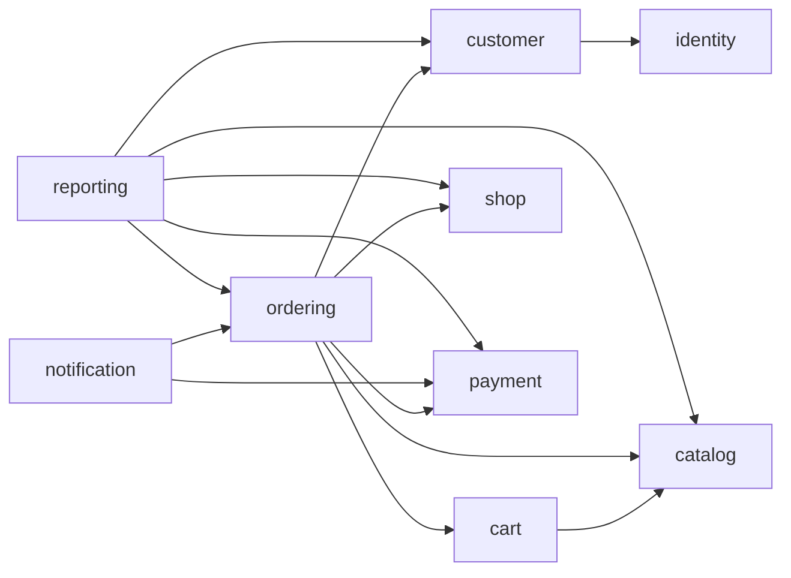

# 苍穹外卖业务重构计划

## 1. 目标、基线与当前交付

目标是保留苍穹外卖的完整核心业务能力，围绕实际业务边界重新建立基于 Java 25、Spring Boot 4.1.1
和 Spring Modulith 2.1.1 的 DDD 模块化单体。一个应用进程、一个部署产物，先按单店业务落地。
单店是当前方案假设；多店、骑手平台、优惠券和库存预占需要独立需求分析，不隐含加入本轮范围。

参考源码固定为 [Danyhug/heima_sky_take_out 的 f4013148](https://github.com/Danyhug/heima_sky_take_out/tree/f4013148cdd168c7af3e311dbb96b71cc532ff6b)。
本次读取了父子 POM、17 个控制器、关键业务服务、MyBatis 映射、11 张表定义、支付回调、定时任务、
WebSocket 和客户端请求代码。没有运行参考工程，也没有导入它的 MySQL 脚本或复制凭证。

本次只完成 P0：模块骨架、中文注释、质量门禁、基础设施验证、接口盘点及本计划。
P1—P7 是后续实施路线，尚未实现。阶段内按纵向用例交付，每个用例同时包含领域行为、持久化、
接口和验证，不先批量生成空的 Controller/Service/Mapper。

## 2. 从源码确认的重构重点

| 源码事实 | 重构决策 | 验收重点 |
| --- | --- | --- |
| 父 POM 使用 Boot 2.7.3，模块为 sky-common、sky-pojo、sky-server | 改为按业务边界分包，使用当前 Boot/Modulith BOM；按需替换旧库 | 无旧 javax Servlet/Springfox 混入 Boot 4 |
| OrderServiceImpl 同时访问订单、地址和购物车 Mapper | 下单通过各模块公开契约取得数据；订单独立保存快照 | 禁止跨模块内部类型与跨模块 SQL |
| 下单把含 amount 的 OrdersSubmitDTO 拷贝到实体 | 金额、打包费和商品可售性由服务端重新计算和校验 | 客户端篡改金额不影响实际应付金额 |
| payment 方法直接调用 paySuccess，返回 null；真实预支付代码被注释 | 支付结果来自已验证的渠道结果，测试网关只在测试使用 | 未支付不能推进为已支付，重复回调不重复处理 |
| 退款代码存在固定 0.01 金额，拒单退款部分被注释 | 独立退款单、真实金额、幂等请求与异步结果确认 | 退款状态可追踪；请求成功不等同退款成功 |
| 订单和地址部分按资源 id 查询/修改，未见对应方法内的归属校验 | 用例层验证操作者和资源所有者，领域对象保护业务状态 | 其他顾客不能查询、修改或取消该资源 |
| 员工密码使用 MD5；员工登录方法记录整个登录 DTO | 引入 Spring Security 的自适应密码编码，避免记录凭证 | 登录、停用、退出、越权、审计脱敏测试 |
| Controller 直接访问 Redis，店铺状态只存 Redis | 业务事实入 PostgreSQL，缓存适配器处理缓存策略 | 清空缓存后业务状态不丢失，失效策略可验证 |
| 订单任务直接修改状态；凌晨定时将部分配送订单改为完成 | 调度器调用订单用例；超时与完成分别定义业务策略 | 支付回调与超时取消竞争不能破坏终态 |
| 支付成功与催单直接调用 WebSocket 广播，连接保存在静态 HashMap | 业务事件驱动通知；独立投递状态、鉴权和并发安全会话管理 | 通知失败不破坏订单事务，重连可补查状态 |
| 报表服务直接访问订单和顾客 Mapper | 公开查询契约与模块自有读模型结合，必要时事件驱动投影 | 口径明确、可重建、与业务事实对账 |

关键证据：
[父 POM](https://github.com/Danyhug/heima_sky_take_out/blob/f4013148cdd168c7af3e311dbb96b71cc532ff6b/pom.xml)、
[订单服务](https://github.com/Danyhug/heima_sky_take_out/blob/f4013148cdd168c7af3e311dbb96b71cc532ff6b/sky-server/src/main/java/com/sky/service/impl/OrderServiceImpl.java)、
[员工服务](https://github.com/Danyhug/heima_sky_take_out/blob/f4013148cdd168c7af3e311dbb96b71cc532ff6b/sky-server/src/main/java/com/sky/service/impl/EmployeeServiceImpl.java)、
[地址服务](https://github.com/Danyhug/heima_sky_take_out/blob/f4013148cdd168c7af3e311dbb96b71cc532ff6b/sky-server/src/main/java/com/sky/service/impl/AddressBookServiceImpl.java)、
[订单任务](https://github.com/Danyhug/heima_sky_take_out/blob/f4013148cdd168c7af3e311dbb96b71cc532ff6b/sky-server/src/main/java/com/sky/task/OrderTask.java)。

上述问题是对固定版本的静态代码观察，不等于已经运行原系统验证过所有故障。
该版本的接口缺口与客户端材料范围见 [接口盘点](REFERENCE_API.md)。

## 3. 业务模块与数据归属

| 模块 | 职责与原能力映射 | 候选模型 / 自有数据 |
| --- | --- | --- |
| identity | 员工登录、员工管理、启停用、身份认证；权限控制逐步完善 | EmployeeAccount、LoginIdentity、Credential；原 employee 的账号职责 |
| customer | 顾客档案、注册后的资料、收货地址、默认地址 | Customer、AddressBook、DeliveryAddress；原 user 的资料职责和 address_book |
| shop | 管理端设置营业状态，补齐用户端营业状态与电话查询 | Shop、OpeningStatus；新增持久化门店配置 |
| catalog | 分类、菜品、口味、套餐、上下架、图片关联 | Category、Dish、SetMeal；原 category/dish/dish_flavor/setmeal/setmeal_dish |
| cart | 添加、减少、合并同规格商品、清空、查看购物车 | ShoppingCart、CartItem、ProductSelection；原 shopping_cart |
| ordering | 下单、订单详情/分页、接单、拒单、配送、完成、取消、再来一单、催单 | Order、OrderLine、Money、RecipientSnapshot；原 orders/order_detail |
| payment | 预支付、通知处理、退款、查询补偿与对账 | Payment、Refund、PaymentGateway；新增支付、退款、回调处理记录 |
| notification | 来单/催单消息、WebSocket 通知、失败重试 | Notification、DeliveryAttempt；新增通知记录 |
| reporting | 工作台、营业额、订单统计、顾客增长、销量 Top10、Excel 导出 | 自有统计读模型与查询服务；按口径新增投影表 |

微信身份交换属于 identity 的外部身份适配；顾客档案由 customer 拥有。登录身份的唯一主体标识
通过公开契约关联顾客资料，避免两个模块互相访问实体。原 user 表不直接复制为两个共享实体。

文件上传先作为 catalog 的文件存储端口及适配器落地，当前只有商品图片需求；当其他模块出现真正
共享的文件管理生命周期时，再抽取独立能力，避免预先建设一个什么都放的 common 模块。

每个模块已预留 api、events、domain、application、infrastructure、web/admin、web/app。
无对应终端需求的包可以保持为空，不能为了目录完整而制造接口。

## 4. 面向对象建模与模块协作

### 聚合负责行为

- `Order` 通过 `confirm`、`reject`、`cancel`、`startDelivery`、`complete` 等业务方法维护状态，
  每个方法验证前置条件；具体命名在实现时统一，不对外提供任意修改 status 的 setter。
- `Money` 校验货币、精度和运算规则；`OrderId`、`CustomerId` 等类型避免错误互换标识。
- `OrderLine` 保存下单时的名称、规格、单价和数量快照，历史订单不随菜品改价而变化。
- `ShoppingCart` 封装规格相等性、数量变化及并发版本；集合不直接暴露为可修改引用。
- `Dish` 与 `SetMeal` 各自封装生命周期；套餐上架校验所引用菜品的规则通过领域服务协作。
- `Payment`、`Refund` 分别表达各自状态机；订单状态和支付状态不能混成一个整数常量集合。
- 应用服务管理事务、加载聚合、调用行为、持久化并发布集成事件。领域模型不依赖 Spring。
- DTO、公开契约和基础设施行映射独立；不可变 DTO/值对象可用 record，聚合根据行为选择普通类。
- 使用组合和构造器注入；仓储、时钟、支付网关、图片存储是有明确替换需求的接口。简单内部类
  不为形式额外加一层接口，不创建万能工具类承担领域行为。

### 依赖白名单按用例逐步开放

当前所有业务模块都禁止跨模块依赖。下表是后续建议方向，箭头表示 Java 代码的依赖方向，
不是事件在运行时流动的方向。

| 消费模块 | 未来允许引用的提供方契约 |
| --- | --- |
| customer | identity 的 api/events |
| cart | catalog 的 api |
| ordering | customer、shop、catalog、cart 的 api；payment 的 api/events |
| notification | ordering、payment 的 events |
| reporting | customer、ordering、payment 的 events；catalog、shop 的必要查询 api |
| identity、shop、catalog、payment | 初期无其他业务模块依赖 |

为避免最常见的订单/支付循环依赖，ordering 通过 payment 的公开 API 创建支付/退款意图，并监听
payment 的结果事件；payment 只保存调用方传入的业务引用，不导入 ordering 的类型或事件。
订单产生自身的业务事件后，由通知和报表模块消费。再来一单由 ordering 编排 cart 的公开能力，
不让 cart 反向依赖 ordering。

公开事件计划使用稳定事件 ID、业务引用、必要版本、发生时间和最小快照，具体事件在对应用例落地
时定义。聚合内部的领域事件与对外集成契约可以显式映射，避免把整个聚合序列化传播。

### 一致性与失败恢复

- 下单时在短事务内取得地址和购物车快照，重新验证商品与门店状态；订单及明细与购物车结算操作
  通过公开 API 参与同一个本地事务。使用购物车版本校验，只移除被结算的条目，避免误删并发新增商品。
- PostgreSQL 支撑聚合更新和 Modulith 事件登记的原子提交；异步消费者使用独立事务和幂等键。
- 支付先持久化请求意图，外部网络调用在数据库事务之外完成；失败可按同一幂等键重试或查询渠道。
- 支付通知校验签名、商户、交易引用、金额和结果，重复/乱序通知不能使终态回退。实现细节在
  接入具体官方 SDK 时确定，不能仅做 JSON 解密就信任通知。
- 超时取消和支付成功使用版本/条件更新竞争；若已取消订单收到有效的迟到支付结果，需要进入
  明确的退款补偿流程，不能重新变成待接单。
- 来单/催单通知由持久化事件触发，记录投递状态。WebSocket 成功写入连接不等同用户已看到消息，
  重连后通过查询恢复状态。
- 增加有界重试、失败记录和观测指标；当前骨架的启动重投配置不能替代完整重试策略。

参考：[Modulith 事务事件](https://docs.spring.io/spring-modulith/reference/events.html)、
[微信支付官方通知说明中的验签与重复处理要求](https://pay.wechatpay.cn/doc/v3/merchant/4012166360)。
后者为通知机制参考，具体小程序支付接口以 P5 接入时的商户产品文档为准。

## 5. 接口兼容与 PostgreSQL 迁移

### 客户端兼容

优先把原后台和小程序作为功能验收客户端。原后台浏览器 `/api/*` 经 Nginx 映射到服务端
`/admin/*`，小程序使用 `/user/*`；web/admin、web/app 是包的职责划分，不代表必须改 URL。
本轮骨架不预设新的业务路由；后续若提供 `/api/admin`、`/api/app`，明确维护兼容适配层或同步
更新客户端，不能默默破坏旧路径。

P1 先固定登录 token 传递方式、旧 `{code,msg,data}` 响应、分页结构、日期格式和 ID 序列化。
旧客户端 DTO 只存在于 web 边界；新接口的 HTTP 状态和 Problem Details 不强行套进旧客户端。
采用脱敏请求/响应样例进行契约测试，同时补齐盘点发现的缺失接口。

Web 中只有构建产物，不假定已经取得可维护的原始前端工程。完整前端重建或源工程补充属于后续
独立工作；这不会阻塞先重构后端，但会影响涉及界面和请求方式的修改。

### 数据迁移

- 当前以新项目新业务表为默认，不直接导入参考 SQL。若后续要求保留历史业务数据，再进行数据迁移。
- 原 11 张表逐项映射到拥有它们的模块；支付、退款、通知、门店配置、报表投影按新模型新增。
- MySQL 的反引号、AUTO_INCREMENT、tinyint、datetime、分页语法转换为 PostgreSQL 的标识、
  identity、明确类型、带时区时间及相应 SQL；涉及日期统计的时区统一明确为业务时区。
- 金额用 decimal/BigDecimal，避免统计链路改成 double；业务时刻使用 Instant/Clock，可测试地
  判断超时；报表按 Asia/Shanghai 计算营业日边界。
- 模块内外键、唯一约束、非空约束和版本列随模型设计；不创建跨模块外键或跨模块仓储查询。
- 默认地址唯一性、外部身份唯一性、业务订单号、支付请求号、退款请求号和消费幂等键均由数据库
  约束兜底；迁移后验证数量、金额汇总、孤立数据和唯一性。
- 初步保留类型化 bigint 主键以方便接口兼容，数据库生成标识；事件 ID 可独立使用 UUID。
  对外 ID 的 JSON 形式必须经过客户端契约测试，订单业务编号不得只依赖毫秒时间戳。
- 不携带原种子账号密码、私钥或云服务配置。已执行 Flyway 文件不回改，所有演进新增迁移。

## 6. 分阶段实施与验收

| 阶段 | 内容与交付物 | 阶段通过条件 | 外部依赖 |
| --- | --- | --- | --- |
| P0 · 当前 | 9 个模块骨架、中文注释、Google 检查、架构约束、PostgreSQL/Flyway、参考 API 清单及计划 | clean verify 成功；真实 HTTP 健康检查；业务包无演示实现 | 已有 PostgreSQL |
| P1 · 契约与身份基础 | 确定旧客户端兼容方案；错误/分页/时间约定；Spring Security、员工账号与权限边界、脱敏审计；公开接口文档 | 登录/退出/停用/权限测试通过；敏感信息不进入日志；旧客户端登录契约明确 | Redis 若采用集中失效或限流 |
| P2 · 商品与营业 | 分类、菜品、口味、套餐、上下架、图片存储、门店持久化配置与查询；商品缓存 | 菜品/套餐真实可维护；套餐关联约束、上传校验、改价与缓存失效验证 | Redis、对象存储 |
| P3 · 顾客与购物车 | 微信身份适配、顾客档案、地址簿、默认地址、购物车数量/规格行为 | 地址归属、唯一默认地址、购物车并发、不同用户隔离；真实登录联调单独通过 | 小程序账号；可先用测试身份提供器验证自动化测试 |
| P4 · 下单与订单核心 | 服务端计价、商品/地址快照、待付款订单、幂等提交、查询、未付款取消、再来一单 | 篡改价格被拒绝或以服务端价格处理；重复提交只建一单；回滚一致；并发购物车不丢数据 | PostgreSQL；不模拟已支付状态 |
| P5 · 支付与履约 | 支付/退款聚合、渠道适配、回调与对账；已付款订单接单/拒单/取消/配送/完成；超时补偿 | 真实渠道联调、重复/伪造/乱序通知、超时竞争、部分失败和退款结果全部验证 | 商户资质、SDK 配置、公网 HTTPS 回调 |
| P6 · 通知与经营 | 事件驱动来单/催单、WebSocket 鉴权、失败重试；工作台、统计、Top10、Excel 导出 | 通知可重试；统计口径与订单/退款核对；投影可重建；导出数据正确 | 既有基础设施；需要时补通知渠道 |
| P7 · 完整联调与交付 | 接入后台/小程序；完整订单闭环、权限/故障场景、迁移演练、性能基线、部署文档 | 契约清单逐项完成或记录经确认的差异；无占位成功接口；端到端真实业务验证 | Nginx/TLS、可用客户端材料 |

P4 不依赖一个伪实现的 PaymentGateway 来推进订单状态，先交付完整的待付款生命周期。
P5 没有真实商户资源时只能标记“领域与自动化验证完成，真实支付联调待完成”。
权限体系、配送规则、通知确认及统计退款口径在对应阶段先写业务规则，再编码，不凭目录结构
宣称 DDD 已完成。

每一阶段都需要中文包/类/方法说明、用例级测试、迁移文件和使用说明；提交前必须执行完整扫描。
阶段验收不以“接口返回 200”代替实际业务行为验证。

## 7. 测试策略与质量门禁

- 领域单元测试覆盖状态机、不变量、金额及时间边界；通过 Clock 控制时间，不依赖等待现实超时。
- Spring Modulith 验证模块依赖、导出契约和循环依赖；模块存在实际用例后使用
  `@ApplicationModuleTest` 与 `Scenario` 验证模块行为及事件。
- ArchUnit 持续约束向内依赖和领域模型纯净性；骨架空包允许存在，已有类没有豁免。
- PostgreSQL 集成测试验证真实 SQL、Flyway、唯一约束、乐观锁和事务回滚；每个上下文独立 schema。
- Redis/对象存储接入后补充真实服务的隔离集成测试，不用内存替代物宣称已验证中间件。
- 支付、通知验证重复投递、进程重启、外部超时和业务竞争；外部测试替身与真实联调报告分开。
- 契约测试覆盖原路径、请求字段、分页、日期、token 与错误响应；端到端覆盖浏览到退款的闭环。
- Google Java Format + Checkstyle 检查全部源码和测试，人工审查中文注释和业务命名的准确性。
- `./scripts/verify.sh` 与提交钩子、CI 使用同一入口；远程 CI 尚待关联实际仓库并设为必需检查。

密码编码参考 [Spring Security 官方说明](https://docs.spring.io/spring-security/reference/features/authentication/password-storage.html)。
新依赖在阶段实施时查询最新稳定版本和兼容性，优先使用 Boot BOM；不一次性堆入尚未使用的 SDK。

## 8. 用户侧准备与后续起点

先准备 Redis 和一种对象存储；微信账号、支付商户及回调环境按 P3/P5 提前准备即可。
具体连接信息和部署要求见 [中间件清单](INFRASTRUCTURE.md)。

下一阶段建议从 **P1：接口兼容约定、身份认证和员工账号** 开始，先让安全边界与客户端协议稳定，
再实施商品和门店业务。本次交付不提前执行 P1。
