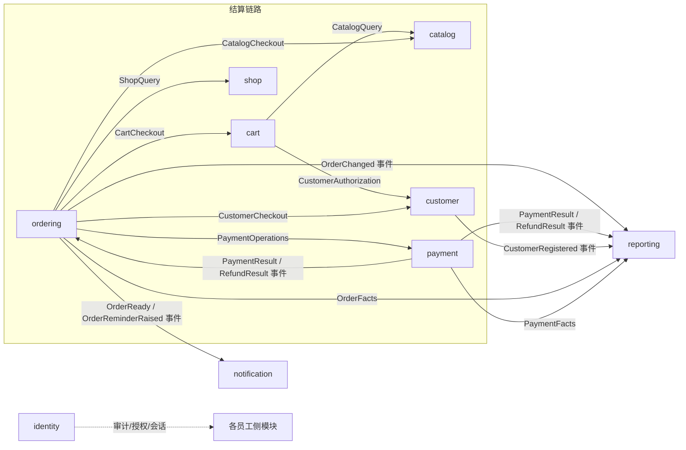

# 领域模型文档（按限界上下文）

后端按 Spring Modulith 组织为九个限界上下文。本目录为每个域沉淀一份模型文档，
内容以 `src/main/java/com/hanserwei/hanmenu/<模块>/domain` 的实际代码为准，便于后续开发对齐。

| 域 | 职责一句话 | 聚合根 | 模型文档 |
| --- | --- | --- | --- |
| identity | 员工账号、角色权限、会话与安全审计 | `EmployeeAccount` | [identity.md](identity.md) |
| customer | 顾客账号、收货地址簿与顾客会话 | `CustomerAccount`（+实体 `DeliveryAddress`） | [customer.md](customer.md) |
| shop | 单店资料与营业状态 | `Shop` | [shop.md](shop.md) |
| catalog | 分类、菜品与套餐目录及图片 | `Category`、`MenuProduct` | [catalog.md](catalog.md) |
| cart | 顾客购物车的展示与结算前选择 | `ShoppingCart` | [cart.md](cart.md) |
| ordering | 订单全生命周期与履约状态机 | `Order` | [ordering.md](ordering.md) |
| payment | 支付与全额退款（支付宝沙箱） | `Payment`、`Refund` | [payment.md](payment.md) |
| notification | 员工端持久化通知、在线推送与阅读进度 | `Notice`、`Receipt`（+实体 `StreamTicket`） | [notification.md](notification.md) |
| reporting | 基于公开事件/API 的可重建经营报表投影 | `ProjectionState` | [reporting.md](reporting.md) |

## 模块协作与事件流

- 同步协作只走各模块 `api` 包的 `@NamedInterface`（如 `CatalogCheckout`、`PaymentOperations`），不访问其他模块内部类或业务表。
- 异步协作走 `events` 包的集成事件，与业务状态同事务登记（Modulith 事件登记表），消费者按业务标识或源版本幂等。
- `payment` 不反向依赖 `ordering`：订单通过 `PaymentOperations` 发起支付，通过 `PaymentResult`/`RefundResult` 事件收到结果。

## 各文档的统一结构

每份模型文档按以下小节组织，方便横向对照：

1. **职责与边界** —— 模块解决什么问题，依赖哪些外部能力。
2. **聚合根** —— 业务方法表（含不变量说明）。
3. **值对象与实体** —— record 值对象及约束。
4. **端口** —— 仓储与外部能力接口。
5. **领域异常** —— 稳定错误分类枚举。
6. **公开契约与集成事件** —— `api` / `events` 包导出内容。
7. **关键业务规则** —— 从代码不变量提炼的规则清单。

## 相关文档

- 架构决策与分层约束：[ARCHITECTURE.md](../ARCHITECTURE.md)
- 数据库迁移（表结构唯一来源）：`src/main/resources/db/migration/V1__*.sql` … `V8__*.sql`
- 各阶段接口契约：[P1](../P1_CONTRACT.md) — [P7](../P7_BACKEND_CONTRACT.md)、[PC1](../PC1_CONTRACT.md) — [PC6](../PC6_CONTRACT.md)
